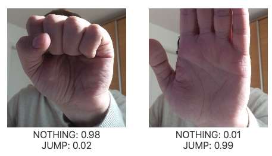

# Teachable Dino

Simple webcam controlled game using Teachable Machine model.

## Live demo

Live demo is available [here.](https://gregavrbancic.github.io/teachable-dino/)

The default trained model has the following gestures supported:




## Get started

Install the dependencies...

```bash
cd svelte-app
npm install
```

...then start with

```bash
npm run dev
```

Navigate to [localhost:5000](http://localhost:5000). You should see your app running.

## Prepare Teachable Machine Model

1. Capture images for two classes: NOTHING and JUMP. Make sure you have named them correctly, otherwise the game won't work as expected.
2. Train the model.
3. Export your trained model with the "Upload (shareable link)" option.
4. Copy your sharable link.
5. Navigate to the app.
6. Paste your sharable link into the input field and click "Start".
7. You should be able to control the character with "JUMP" gesture of your choice.
